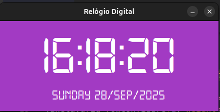

# ⏰ Relógio Digital
Este é um projeto simples de **Relógio Digital** desenvolvido em **Python** utilizando a biblioteca **Tkinter** para interface gráfica.  
Ele exibe a **hora atual em tempo real**, além da **data e dia da semana**, com estilo personalizado usando a fonte digital *digital-7*.

---

 

## 📸 Demonstração

 

>## 📡 Tecnologias utilizadas
> - Python 3
>
> - Tkinter (interface gráfica)
>
> - Datetime (para pegar data e hora do sistema)
>
> - Pyglet (para carregar fonte digital personalizada)

 

## ▶️ Como executar
1. Clone o repositório  
git clone https://github.com/GabriellydaCosta/relogio-digital.git  
cd relogio-digital

2. Instale as dependências necessárias:  
pip install pyglet

3. Certifique-se de que o arquivo da fonte digital-7.ttf está na mesma pasta do código.

4. Execute o programa:  
python relogio.py

 

## 📌 Funcionalidades
✔️ Exibe a hora em tempo real

✔️ Mostra o dia da semana e a data

✔️ Interface simples e estilizada

✔️ Usa fonte digital personalizada
